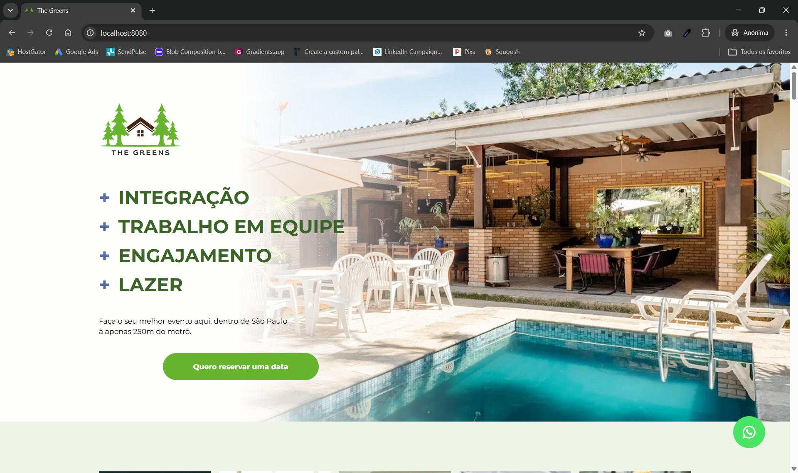

# The Greens Landing Page

Landing page institucional desenvolvida para apresentar o **The Greens**, um espaço exclusivo para eventos corporativos, confraternizações empresariais, treinamentos, workshops e encontros estratégicos.

> O cenário ideal para transformar encontros corporativos em experiências memoráveis.

---

## 📋 Sobre o projeto

Este projeto consiste em uma landing page responsiva criada para apresentar a estrutura, os diferenciais e as possibilidades oferecidas pelo The Greens para empresas e organizações.

A página destaca:

* Espaços para eventos corporativos
* Infraestrutura completa
* Ambientes integrados à natureza
* Áreas para confraternizações e treinamentos
* Diferenciais do espaço
* Galeria de imagens
* Formulário para geração de leads
* Integração com WhatsApp para atendimento comercial

---

## 🌐 Landing Page Online

Acesse a versão publicada:

https://lp.thegreens.com.br/

---

## 🛠 Tecnologias utilizadas

* HTML5
* CSS3
* TypeScript
* Tailwind CSS
* PostCSS
* Webpack

---

## 📂 Estrutura do projeto

```text
.
├── src/
│   ├── assets/
│   │   ├── img/            # Imagens e assets da landing page
│   │   ├── pdf/            # Materiais institucionais
│   │   ├── video/          # Vídeo promocional do espaço
│   ├── global.d.ts
│   ├── index.css       # Estilos da aplicação
│   ├── index.html      # Estrutura da página
│   └── index.ts        # Scripts principais
│
├── package.json
├── package-lock.json
├── webpack.config.js
├── tailwind.config.js
├── postcss.config.js
├── tsconfig.json
├── .gitignore
└── README.md
```

---

## 🚀 Como executar o projeto

### Clone o repositório

```bash
git clone https://github.com/douglas-moura/landing-page-the-greens.git

cd landing-page-the-greens
```

### Instale as dependências

```bash
npm install
```

### Ambiente de desenvolvimento

Inicia o servidor local:

```bash
npm run serve
```

---

## 🔨 Scripts disponíveis

### Build para produção

```bash
npm run build
```

### Build para desenvolvimento

```bash
npm run build:dev
```

### Servidor local

```bash
npm run serve
```

### Observa alterações nos arquivos

```bash
npm run watch
```

---

## 📱 Responsividade

A landing page foi desenvolvida seguindo a abordagem **mobile-first**, garantindo excelente experiência de navegação em:

* Smartphones
* Tablets
* Notebooks
* Desktops

---

## 🎯 Objetivo

Apresentar o The Greens como uma solução diferenciada para empresas que buscam realizar eventos corporativos em um ambiente sofisticado, confortável e integrado à natureza.

A landing page tem como objetivo:

* Divulgar a estrutura do espaço
* Destacar seus diferenciais
* Gerar oportunidades comerciais
* Facilitar o contato com a equipe de atendimento
* Converter visitantes em potenciais clientes

---

## 📄 Licença

Este projeto está licenciado sob a licença MIT.

Consulte o arquivo `LICENSE` para mais informações.
